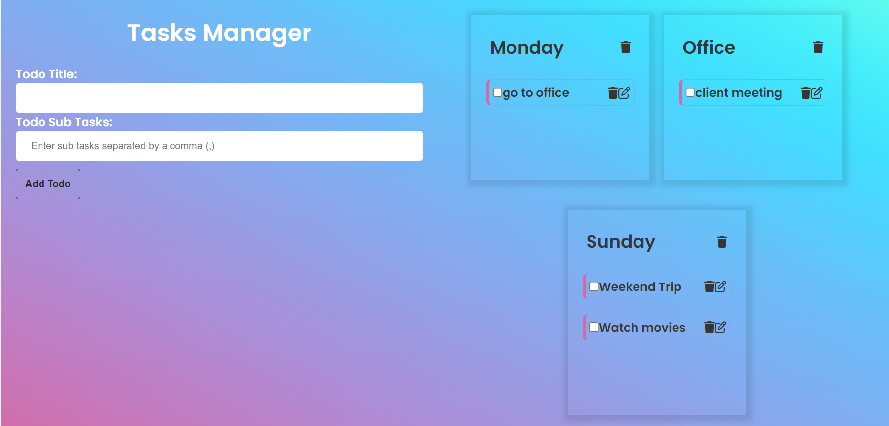

# Tasks Manager

A simple todo app that allows you to add, view, and delete todo items and their sub tasks.

## Features

- Add a todo item with a title and multiple sub tasks
- View the todo list
- Mark sub tasks as completed
- Delete todo items and sub tasks
- Edit sub tasks

## Technologies Used

- HTML
- CSS
- JavaScript
- Local Storage

## How to Use

1. Enter a todo title and sub tasks (separated by a comma) in the form and click "Add Todo"
2. The todo and its sub tasks will be added to the todo list
3. Check the checkbox next to a sub task to mark it as completed
4. Click the trash icon next to a todo or sub task to delete it
5. Click on the edit icon to edit the task name , that icon acts as a toggle to open and close edit form.
 
 [Live Link](https://friendly-semolina-cde4ad.netlify.app/)
 

